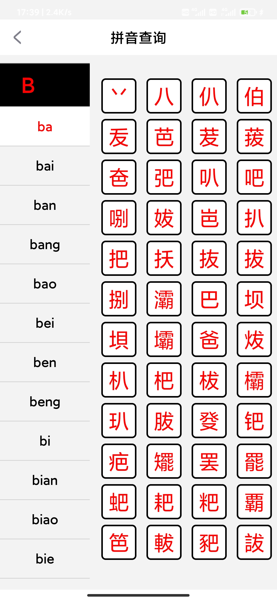
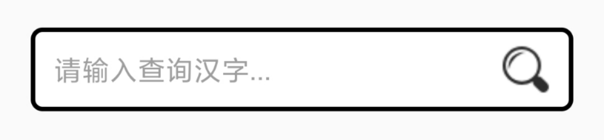
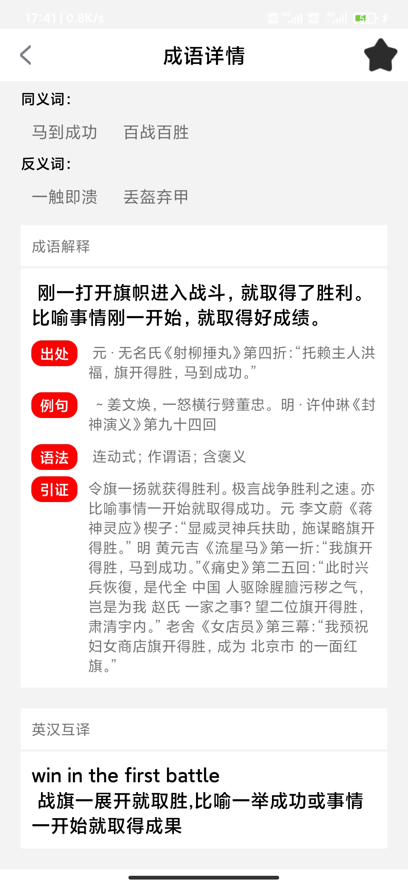

### 实验目的：设计一款APP

### 实验要求：运用所学的知识，以及网上搜索的其他相关知识与API，设计一款可在手机上运行的APP

### 实验内容：

# 第一部分 主界面

1、运行“中华字典”APP，首先看到欢迎界面，右上角有5秒的倒计时，倒计时到0秒自动跳转到APP主界面，也可以直接点击右上角“跳过”字样进行跳转，主界面可以进行“文字查询、拼音查询、部首查询、成语查询、图文识字”，每次打开APP，下方的“每日一句”都会随机更新。

# 第二部分 拼音查询

1、点击“拼音查询”，可以看到界面左侧是拼音列表；右侧为选中拼音的汉字列表，向上拖动可以加载下一页；点击汉字可以进入“文字详情”，包括读音、部首、笔画、五笔、基本释义和详细解释；点击右上角的星星可以收藏汉字，再点击取消收藏，红色表示已收藏，黑色表示未收藏。（该功能引用聚合数据中的“新华字典”API）

# 第三部分 部首查询

1、点击“部首查询”，与“拼音查询”类似，可以看到界面左侧是部首列表；右侧为选中部首的汉字列表，向上拖动可以加载下一页；点击汉字可以进入“文字详情”，包括读音、部首、笔画、五笔、基本释义和详细解释；点击右上角的星星可以收藏汉字，再点击取消收藏，红色表示已收藏，黑色表示未收藏。（该功能也是引用聚合数据中的“新华字典”API）

# 第四部分 汉字查询

1、在主界面的搜索框中输入汉字，点击查询即可跳转到该汉字的“文字详情”，需要注意的是只允许输入单个汉字。（该功能也是引用聚合数据中的“新华字典”API）

# 第五部分 成语查询

1、点击“成语查询”，可以看到界面上方有搜索框，下方为历史记录；在搜索框输入要查询的成语，点击查询即可跳转到该成语的“成语详情”，包括拼音、同义词、反义词、词语解释和英汉互译；点击右上角的星星可以收藏汉字，再点击取消收藏，红色表示已收藏，黑色表示未收藏；若输入不是成语，将弹出“此成语无法查到，请重新查询！”；每次查询过后，下方的历史记录都会记录每一条查询记录，直接点击历史记录中的条目也可进行跳转。（该功能引用聚合数据中的“成语词典”API，比较可惜的是该模块只能查询四字成语）

# 第六部分 图文识别

1、点击“图文识别”，自动跳转到相机，第一次使用会向用户申请权限，同意后可以直接进行拍照识别，或从图库中选择已有的图片进行识别，同样的打开图库前也会向用户申请权限；会自动过滤掉非中文的字符，保留汉字，直接点击汉字可跳转到“文字详情”（该功能引用百度智能API的“文字识别OCR“）

# 第七部分 设置

1、收藏

回到主界面，点击右上角的”设置“，可跳转到”设置“界面，点击”收藏“，可以看到左右各有”汉字“和“成语”的收藏列表，分别点击“汉字”与“成语”字样可以在两个列表之间查看，或直接向左右拖动也有同样的效果；点击列表中的汉字或成语都可跳转到对应的“文字详情”或“成语详情”界面，对已收藏的汉字或成语取消收藏，该汉字或成语就会从收藏列表中移除。

2、反馈与好评

该部分还未编写具体的功能实现，现在点击会跳转至“施工”界面，按“返回”即可回到“设置”界面。

3、分享

感觉APP体验还不错，想推荐给朋友使用？点击“分享”即可跳转到其他应用，提醒一下朋友。这里以微信为例子，将好消息发送其他人。

4、关于我们

点击“关于我们”，跳转至以下页面，点击“检查新版本”，弹出“当前以为最新版本”，模拟时常有版本更新的情况。

# 第八部分 数据库缓存

1、在“汉字查询”、“拼音查询”、“部首查询”和“成语查询”中，加入了数据库来缓存查询过的汉字和成语，这样做的目的是：当用户处在无网络的状态下，依然可以查询已经缓存过的内容，而不至于落到“无网络无法查询”的情况。

先将网络断开，这时“汉字查询”、“拼音查询”、“部首查询”、“成语查询”和”图文识别“功能都无法正常使用，未缓存过的汉字和成语都无法正常显示出来，但在断网之前已缓存（查询）过的内容则可以正常显示，最明显的就是收藏列表中的汉字和成语都可以正常显示。

### 实验总结：

#### 心得收获：通过本次较为全面并独立的实验，我更深刻地领悟到了Android项目开发的精髓，每一个界面布局，每一个代码实现，甚至是从外部引用来的第三方API，这些都需要我们程序员自发进行编写与搭配，在这一整个编写的过程中，既有让人苦恼的bug，也有灵感泉涌的兴奋，更学到了一个项目应当以模块进行划分，才能避免让自己进入手足无措的境地。

#### 评价：