[Toc]

# 一、工具链的安装

## 一、下载Android Studio

1.下载Android Studio安装包，官网地址：http://www.android-studio.org/

版本的话可以选择自己喜欢的，但建议用新一点的版本。

2.下载完安装包后，双击下载文件

3.选择安装路径

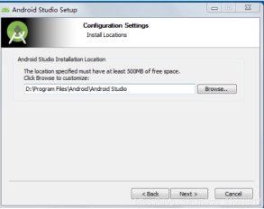

4.选择Do not import settings

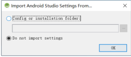

5.安装Android的SDK

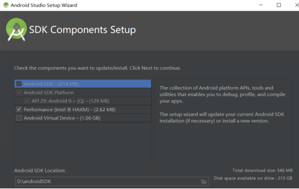

6.选择自己需要的内容（不要太小，因为小了虚拟机可能会卡）

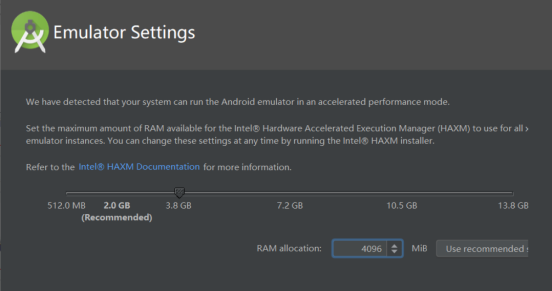

7.安装成功后，打开Android Studio显示界面如下：

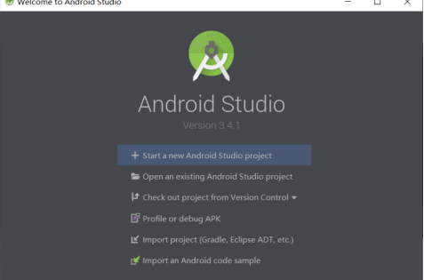

## 二、下载Git

1.到Git的官网上下载，https://git-scm.com/

2.点击Next

3.继续Next

4.下载完成后，点击Finish即可

## 三、下载和使用SourceTree

1.到Sourcetree官网上下载，https://www.sourcetreeapp.com/

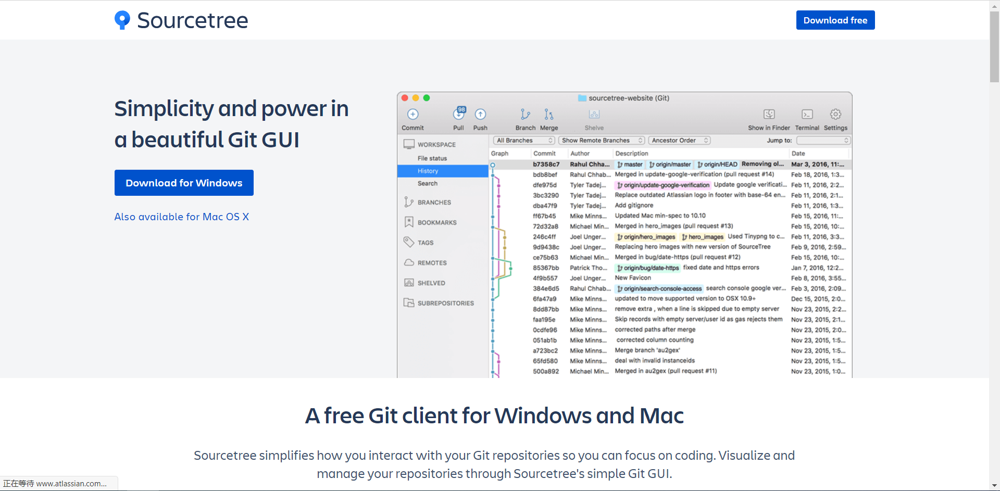

2.下载完成后，打开SourceTree，点击右上角的设置

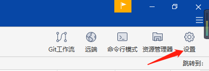

3.出现以下界面，点击添加

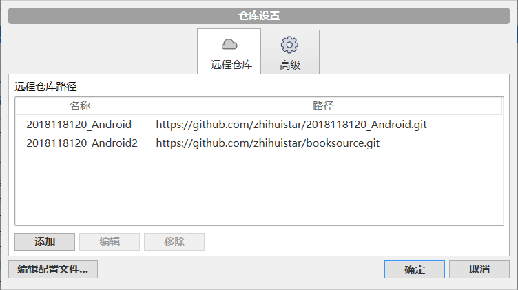

4.输入你想抓取的github的Http地址，并输入远端名称（第一次使用会让你登录你的Github账号，输入即可，这里跳过介绍），点击确定即可

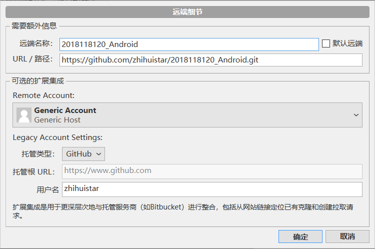

## 四、下载MarkDown

1.到Typora官网上下载，https://typora.io/

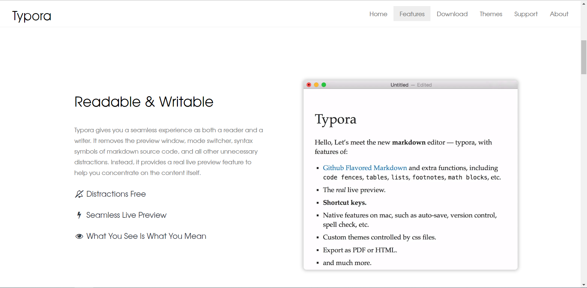

## 五、SSH授权

1.点击SourceTree的工具，创建或导入SSH密钥

2.点击Generate，然后在空白区域快速移动鼠标生成随机SSH密钥

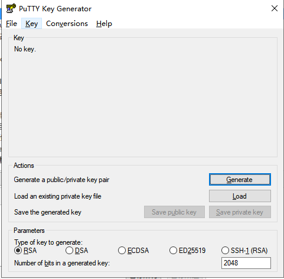

3.把框中的内容复制，需要的话点击Save public key和Save private key，分别保存好,也可以为自己的密钥设置密码，起到双重保护的作用，只需要在Key passphrase和Confirm passphrase输入你想要的密码即可

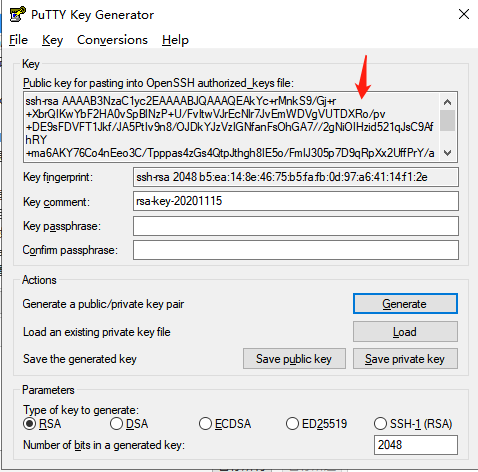

4.登录你的Github，点击右上角自己头像，选择Settings

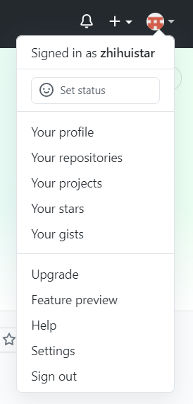

5.选择SSH and GPG keys

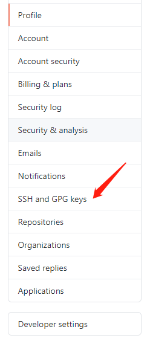

6.点击New SSH key

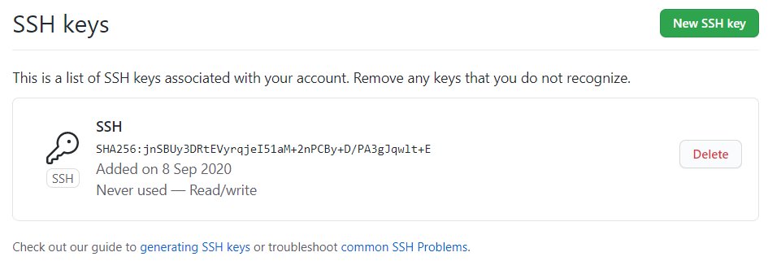

7.输入你预命名的Title和刚才复制的SSH密钥后点击Add SSH key即可

8.找到下图这个东西，右键点击后，选择Add Key

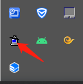

9.将你刚才的私钥导进去,后缀名为.ppk，导入成功后，可以看到

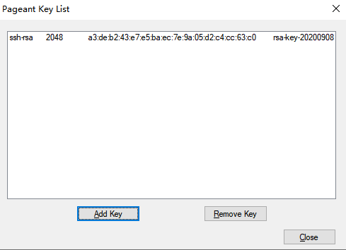

# 二、第一个Android项目——Hello,World

1.打开安卓，创建一个新项目

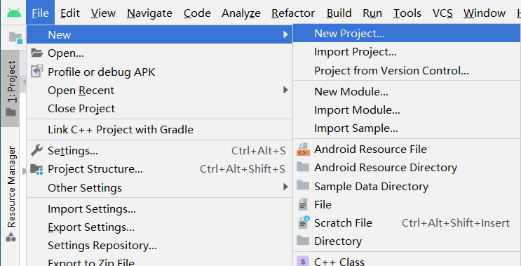

2.点击Empty Activity，Next

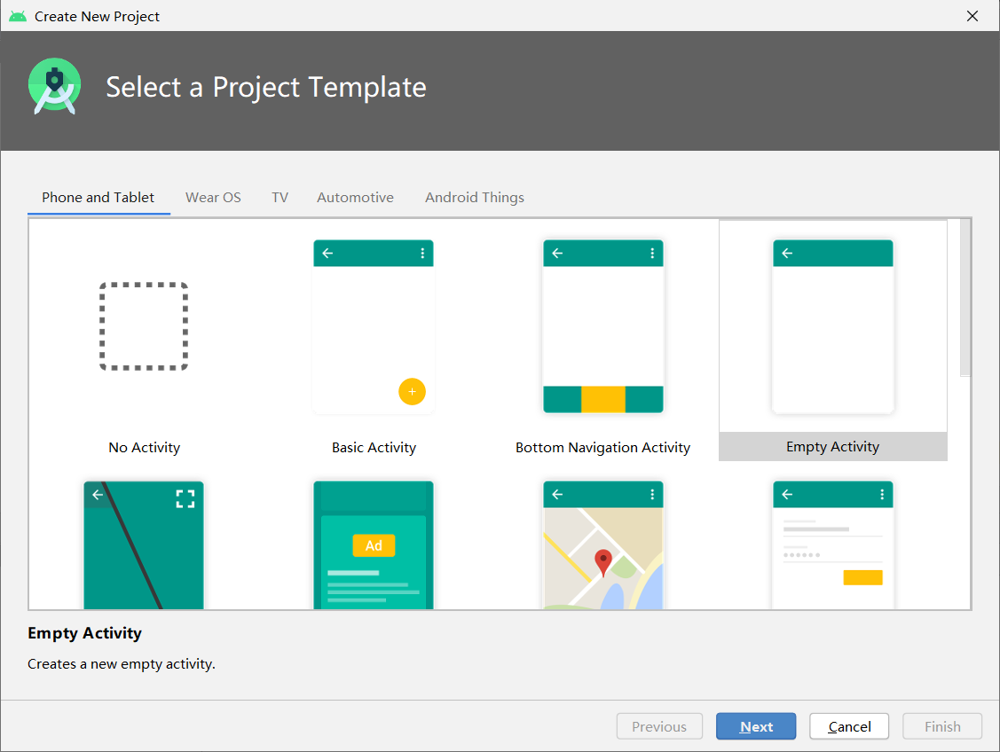

3.在Name栏输入项目名后，点击Finish即可

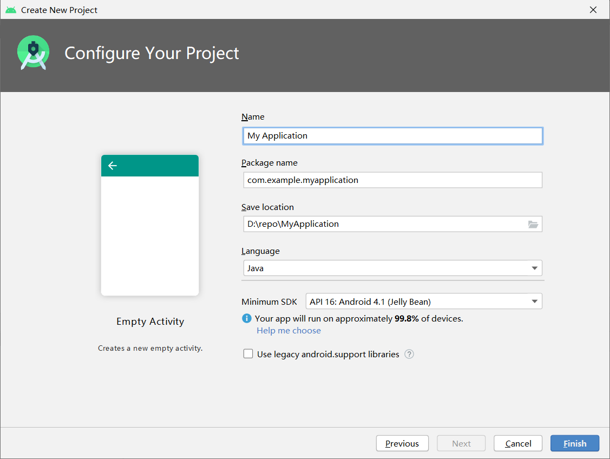

4.创建成功后，点击运行

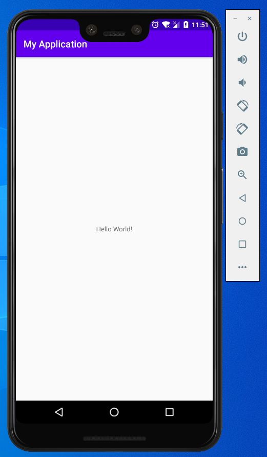

 