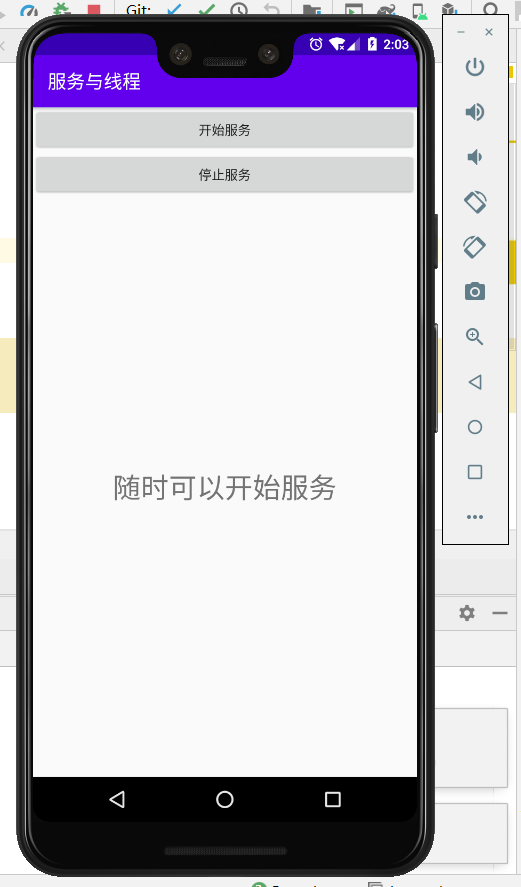
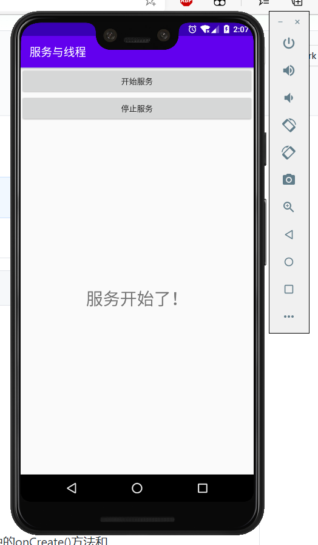
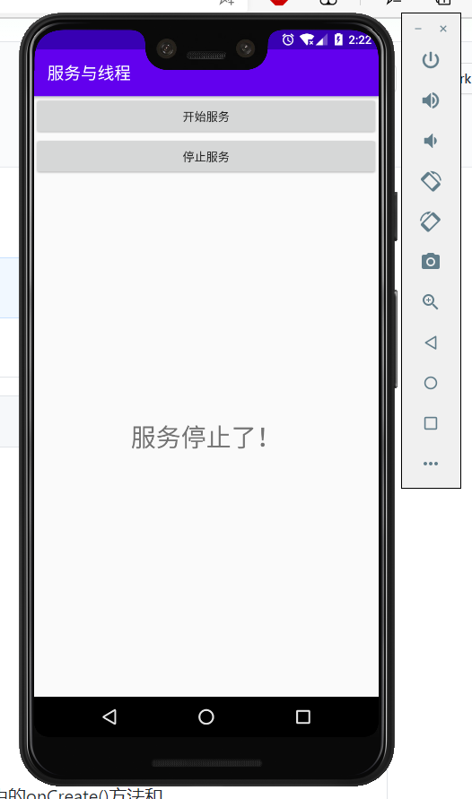

### 实验目的：掌握启动和停止服务

### 实验要求：启动和停止服务，服务代码运行在显示子线程

### 实验内容：

1、运行程序，可以看到“开始服务”和“停止服务”两个按钮，界面中央显示“随时可以开始服务”字样，此时没有开始服务

2、点击“开始服务”按钮，服务开启，并调用子线程将界面中央的TextView更新，显示为“服务开始了！”

3、再点击“停止服务”按钮，服务停止，并调用子线程将界面中央的TextView更新，显示为“服务停止了”

4、之后重复类似的操作可以再次开启服务以及停止服务

### 实验总结：

#### 心得收获：通过本次实验，使我对服务的启动和停止，以及其运作的机制有了初步的认识。服务十分适合去执行那些不需要和用户交互而且还要求长期运行的任务，使用服务能够让用户的手机打开多个应用程序时，每个应用程序依旧能够有条不紊的执行相应的功能。

#### 评价：