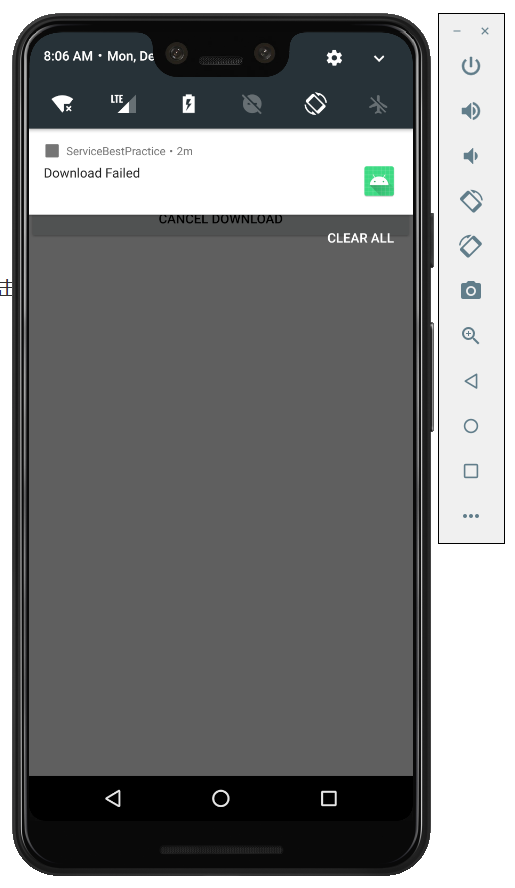

### 实验目的：掌握活动和服务之间的绑定

### 实验要求：使用活动绑定服务，在服务类中实现下载功能，并让下载的服务代码运行在异步任务的子线程中

### 实验内容：

1、运行程序，会向用户申请访问SD卡的权限，点击“ALLOW”，然后点击“START DOWNLOAD”开始下载，下方会弹出Toast显示”Downloading...“，且下拉系统状态栏可以查看实时下载进度

2、在下载完成之前，点击”PAUSE DOWNLOAD“按钮，下载暂停，再点击”START DOWNLOAD“按钮继续下载

3、在下载完成之前，点击”CANCEL DOWNLOAD“按钮，下载取消，原先下载好的数据包会被删除，再点击“START DOWNLOAD”按钮可重新下载

4、若下载过程中出现断网，下载将暂停，下方弹出Toast显示“Download Failed”，网络恢复后，再次点击“START DOWNLOAD”按钮可继续下载

5、最终下载完成后，下方会弹出Toast显示“Download Success”，可以在文件浏览器找到下载好的文件

### 实验总结：

#### 心得收获：通过本次实验，使我掌握了服务的绑定，并且使用活动去控制服务的运行。通过一整个实验，让我对服务的使用有了更深的了解，明白如何使用服务去完成一个具体的功能操作，并与活动紧密联系起来。

#### 评价：