### ***\*实验目的：掌握并深入理解活动的生命周期\****

### ***\*实验要求：展示生命周期的回调函数在不同条件下的触发条件和运行机制\****

### ***\*实验内容：\****

通过调试一步步显示各步骤的函数调用

一、打开Hello1

1、运行程序，首先执行Hello1的onCreate()函数

 

2、执行Hello1的onStart()函数

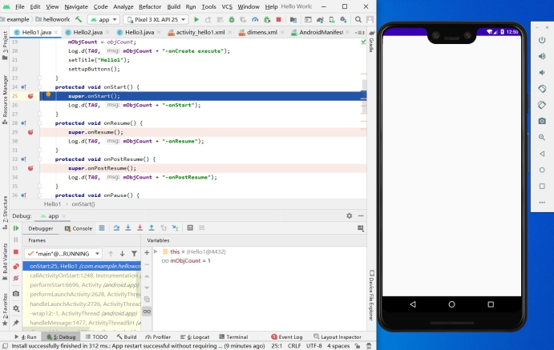 

3、执行Hello的onResume()函数

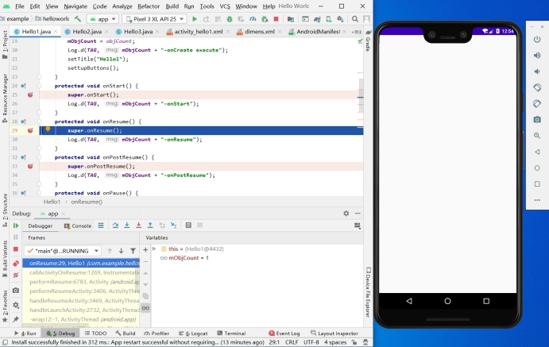 

4、执行Hello1的onPostResume()函数

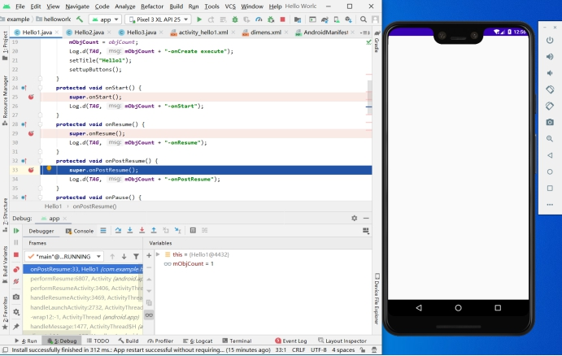 

5、显示Hello1活动

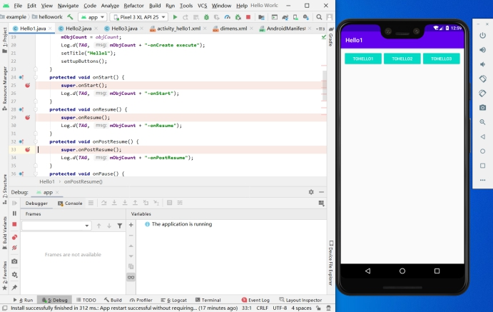 

二、打开Hello2

1、点击TOHELLO2，首先执行Hello1的onPause()函数

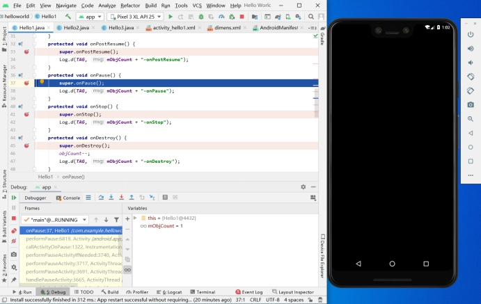 

2、执行Hello2的onCreate()函数

 

3、执行Hello2的onStart()函数

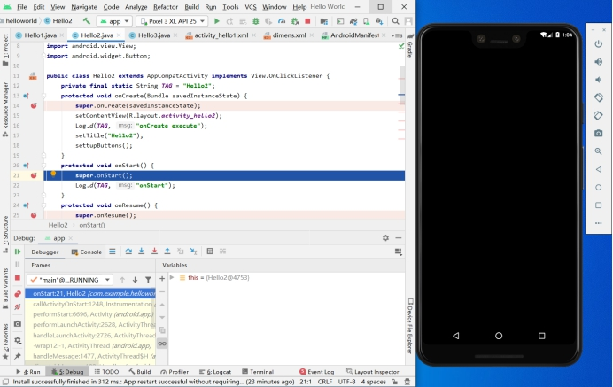 

4、执行Hello2的onResume()函数

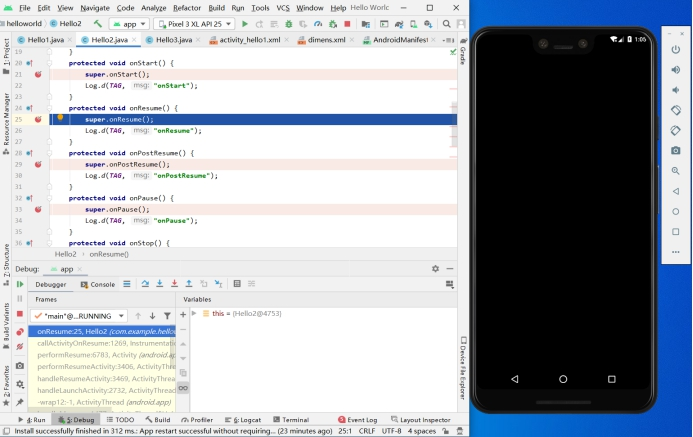 

5、执行Hello2的onPostResume()函数

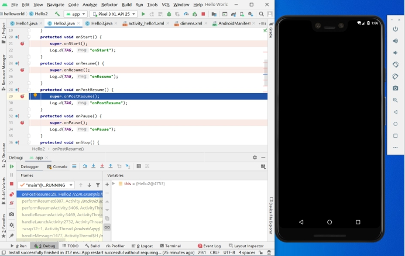 

6、执行Hello1的onStop()函数，显示Hello2活动

 

三、返回

1、点击返回键，首先执行Hello2的onPause()函数

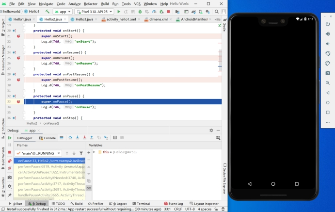 

2、执行Hello1的onStart()函数

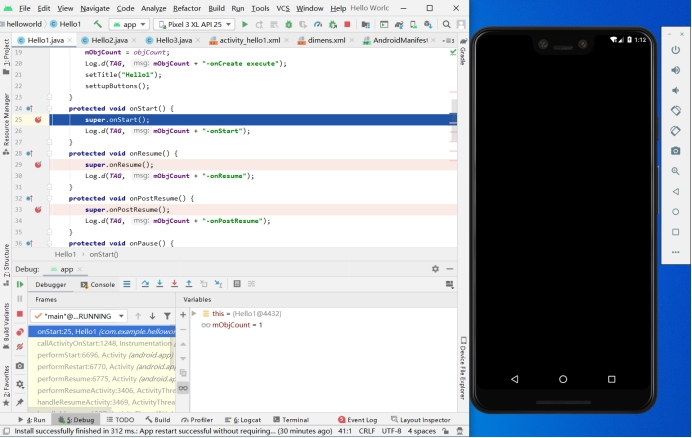 

3、执行Hello1的onResume()函数

 

4、执行Hello1的onPostResume()函数

 

5、执行Hello2的onStop()函数，返回到Hello1活动

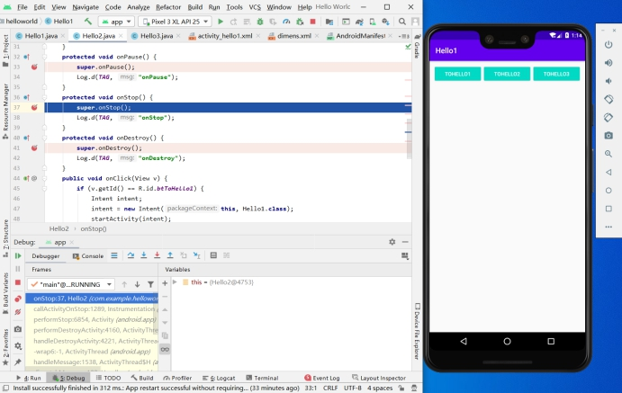 

6、执行Hello2的onDestroy()函数

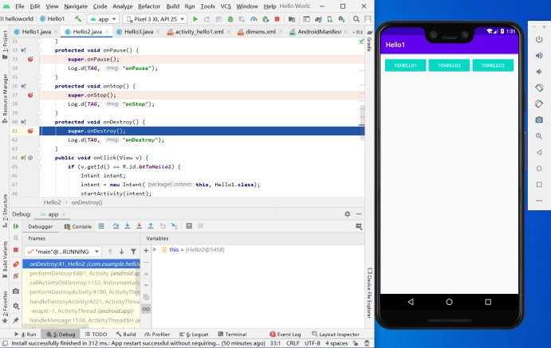 

四、再返回

1、点击返回键，首先执行Hello1的onPause()函数，回到桌面

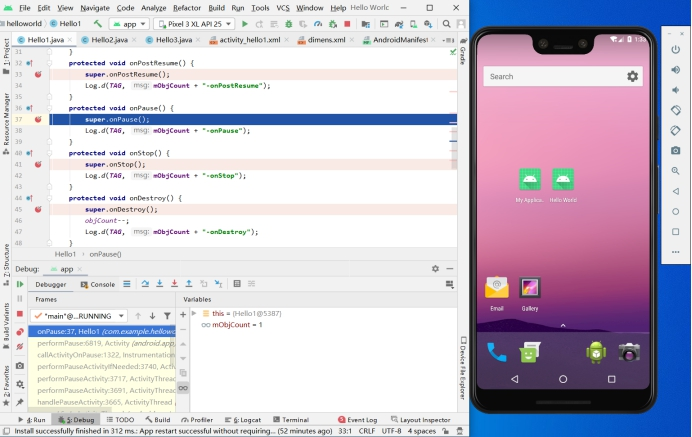 

2、执行Hello1的onStop()函数

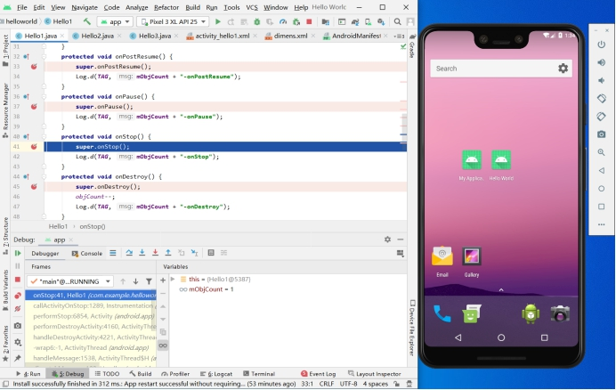 

3、执行Hello1的onDestroy()函数

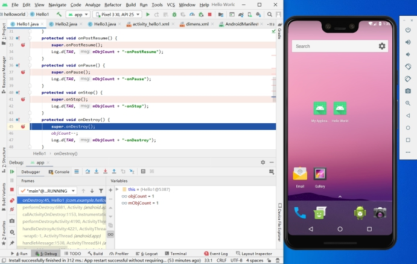 

### ***\*实验总结：\****

#### ***\*心得收获：通过debug调试，使我对安卓活动的生命周期有了更深刻的理解。掌握活动的生命周期可以更好的管理应用资源，\*******\*知晓程序运行过程中的步骤顺序，对未来的学习起很大的作用\*******\*。\****

#### ***\*评价：\****