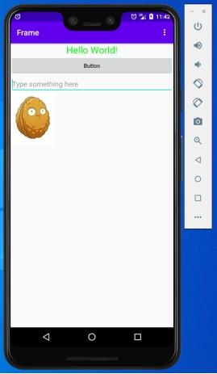
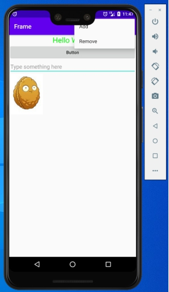
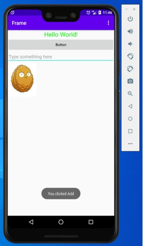
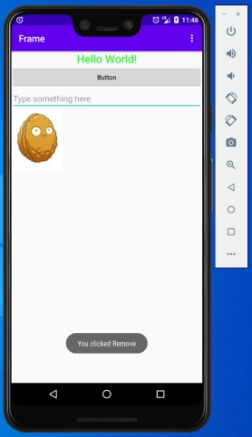
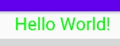
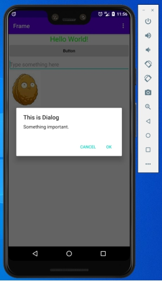
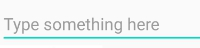
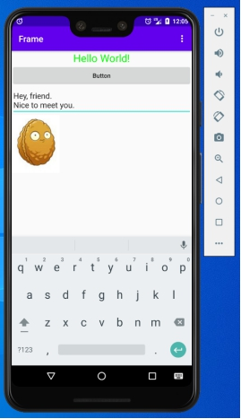

### ***\*实验目的：掌握并深入了解安卓的UI设计\****

### ***\*实验要求：自定义布局UI界面，了解布局间的嵌套关系，以及常用控件的使用方式\****

### ***\*实验内容：\****

1、主界面

 

2、界面右上角有一个“三个点”的标志，那是menu菜单，里面的菜单项默认是不会显示的，只有点击菜单按钮才会弹出选项内容，这边分别有Add和Remove两个选项，分别点击会弹出提示

 

 

3、TextView内容为“Hello World!”，用过修改字体大小以及颜色，呈现出现在的效果

 

4、Button按钮宽度与当前屏幕同宽，高度以文字内容为基础，点击按钮将调用AlertDialog弹出一个对话框，点击“OK”或“Cancel”即可关闭

 

5、EditText提供用户编辑内容的功能，可直接在输入区域输入文本内容，并且在未输入内容的时候会有提示的文字“Type something here”，为了美观，指定了输入内容的显示范围只有两行，当超出时会隐藏在前面

 

6、最后通过ImageVIew实现展示图片的功能，由于事先设置好了分辨率，这样不管图片多大，都可以完整地展示出来

 

### ***\*实验总结：\****

#### ***\*心得收获：通过本次实验，逐步掌握了安卓中的布局和各种控件的使用，也进一步了解它们之间的机制，在设计APP时需要对界面进行美化，\*******\*给用户以更好的体验\*******\*。\****

#### ***\*评价：\**** 