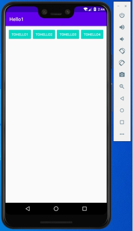
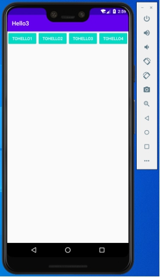
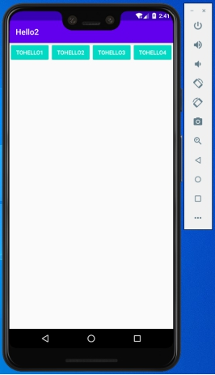
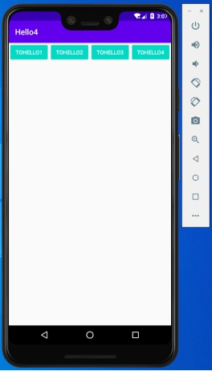
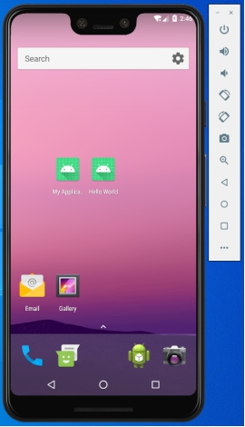

### 实验目的：掌握四种启动模式的机制和不同

### 实验要求：通过编程实践，了解四种启动模式各自的机制和他们的不同点

### 实验内容：

直接运行程序说明singleTask、standard、singleTop和singleInstance四种启动模式的返回栈管理模式

一、singleTask（Hello1活动为singleTask启动模式）

1、运行程序，显示Hello1活动

 

2、点击TOHELLO2，显示Hello2活动

 

3、点击TOHELLO1，显示Hello1

 

4、点击返回键，程序退出，回到桌面

 

二、standard（Hello2活动为standard启动模式）

1、运行程序，显示Hello1活动

 

2、点击TOHELLO2，显示Hello2活动

 

3、再点击TOHELLO2，显示Hello2活动

 

4、点击返回键，回到Hello2活动

 

5、点击返回键，回到Hello1活动

 

6、点击返回键，程序退出，回到桌面

 

三、singleTop（Hello3活动为singleTop启动模式）

1、运行程序，显示Hello1活动

 

2、点击TOHELLO3，显示Hello3活动

 

3、再点击TOHELLO3，显示Hello3活动

 

4、点击TOHELLO2，显示Hello2活动

 

5、点击TOHELLO3，显示Hello3活动

 

6、点击返回键，回到Hello2活动

 

7、点击返回键，回到Hello3活动

 

8、点击返回键，回到Hello1活动

 

9、点击返回键，程序退出，回到桌面

 

四、singleInstance（Hello4活动为singleInstance启动模式）

1、运行程序，显示Hello1活动

 

2、点击TOHELLO4，显示Hello4活动

 

3、点击TOHELLO2，显示Hello2活动

 

4、点击返回键，回到Hello1活动

 

5、点击返回键，回到Hello4活动

 

6、点击返回键，程序退出，回到桌面

 

### 实验总结：

#### 心得收获：通过本次实验，掌握了四种启动模式的机制以及不同点，日后进行开发的时候，可以针对特定的需求为每个活动指定不同的启动模式，能对不同的情形正确选择对应的启动模式，需要进一步的加强学习。

#### 评价：