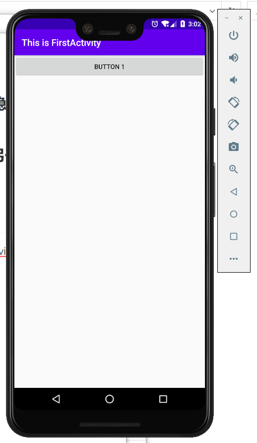
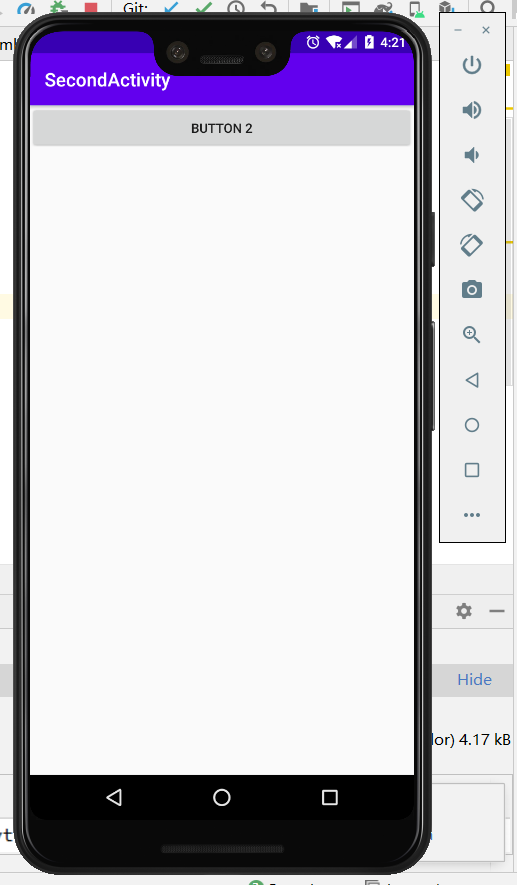
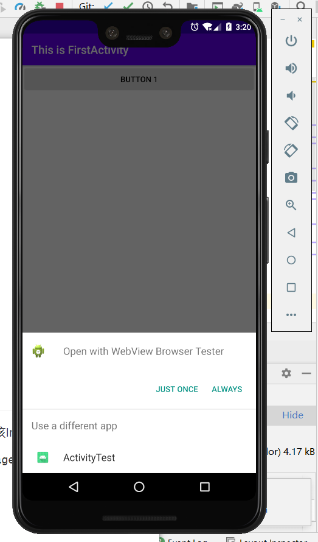
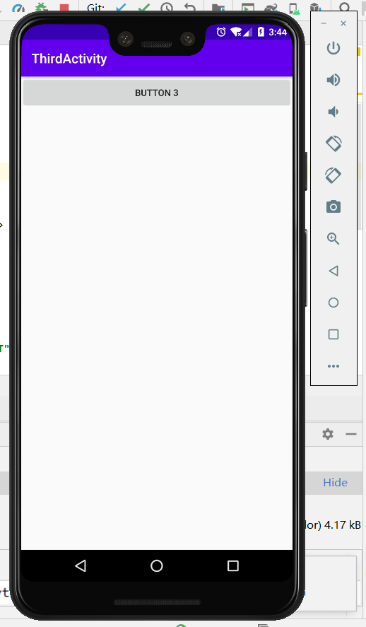
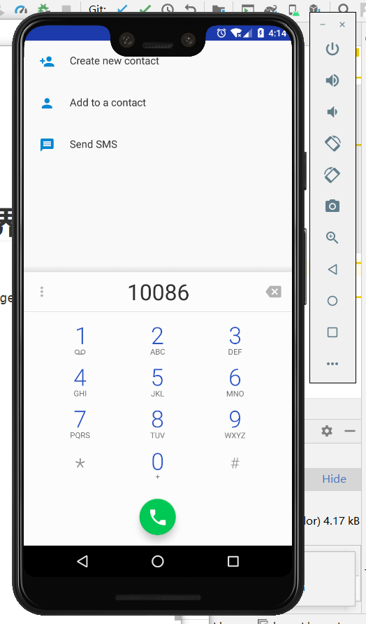
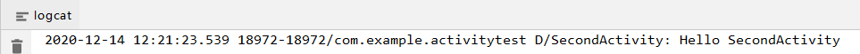
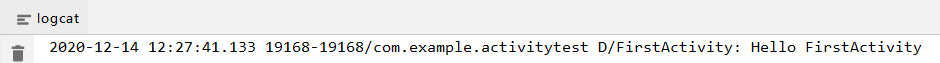

### 实验目的：了解并掌握Intent应用，特别是系统内置隐含Intent和自定义Intent的使用方式

### 实验要求：通过广播的形式，在一个现有活动中启动另一个活动

### 实验内容：

# 第一部分 使用显式Intent

1、运行程序，可以看到MainActivity界面，点击按钮Button 1，启动SecondActivity这个活动

2、如果想回到上一个活动，只需按下Back键销毁当前活动

# 第二部分 使用隐式Intent

1、运行程序，点击按钮Button 1，可以看到打开了系统浏览器

# 第三部分 更多隐式Intent的用法

1、运行程序，点击按钮Button 1，系统自动弹出一个列表，显示当前能够响应该Intent的所有程序

2、选择WebView Browser Tester，可以打开浏览器，显示百度的主页

3、选择ActivityTest，则会启动ThirdActivity

# 第四部分 隐式Intent调用系统拨号界面

1、运行程序，点击按钮Button 1，程序跳转到系统拨号界面

# 第五部分 向下一个活动传递数据

1、运行程序，点击按钮Button 1，跳转到SecondActivity，且可以从logcat看到传递过来的数据

# 第六部分 返回数据给上一个活动

1、运行程序，点击按钮Button 1，进入SecondActivity，再点击Button2（或点击Back键）可以回到FirstActivity，且logcat显示返回的数据

### 实验总结：

#### 心得收获：通过对上述例子的调试，使我对Intent有了初步的了解，特别是认识到隐式意图的强大功能，在日后的编程中，通过使用意图，可以实现更多方便完善的功能。

#### 评价：