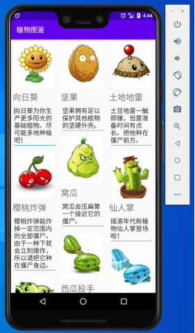

### ***\*实验目的：了解并掌握RecyclerView的使用方式和缓冲机制\****

### ***\*实验要求：使用RecyclerView，自定义一个瀑布流布局的界面，掌握RecyclerView的使用方式\****

### ***\*实验内容：\****

1、主界面

 

2、点击图片会弹出一个短暂的toast，显示“这是***的图片”

 

3、点击名字也会弹出一个toast，显示“这是***的名字”

 

4、每个植物都由ImageView，TextView和EditText三部分组成，用户可以直接在植物的“功能”上进行编辑

 

布局采用的是瀑布流布局，这是RecyclerView比ListView更人性化的一点

### ***\*实验总结：\****

#### ***\*心得收获：通过本次实验，逐步掌握了RecyclerView的使用方式，并理解了RecyclerView的加载机制。除此之外，通过对回调函数的使用，使我对编写和使用回调函数有了更深的理解，\*******\*通过与其他控件的搭配，可以做出很有趣的东西\*******\*。\****

#### ***\*评价：\****