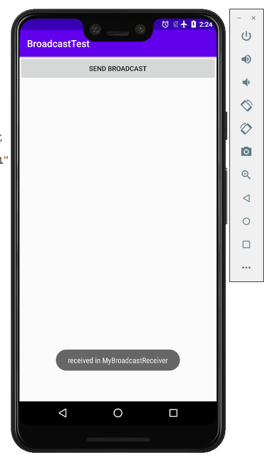

### 实验目的：了解并掌握广播以及自定义广播的使用方式

### 实验要求：通过广播的形式，测试网络发生变化时出现的情况

### 实验内容：

# 第一部分 动态注册监听网络变化

1、运行程序，首先会在注册完成时收到一条广播

2、按Home键回到主界面（注意不能按back键，否则onDestroy()方法会执行），尝试着开关飞行模式来启动和禁用网络，可以看到有Toast提醒网络发生了变化

# 第二部分 优化，实现告知用户有无网络

1、运行程序，收到的广播变成“network is available”

2、再次通过开关飞行模式，观察网络的变化情况

# 第三部分 静态注册实现开机启动

1、运行程序，重启模拟器，启动完成后可以看到开机广播“Boot Complete”

# 第四部分 发送标准广播

1、运行程序，点击Send Broadcast按钮，收到Toast

# 第五部分 发送有序广播

1、运行程序，点击Send broadcast按钮，分别弹出两次提示信息

2、设置BroadcastTest2的广播接收器优先级比BroadcastTest高，可以看到两条Toast的顺序发生了变化

3、在BroadcastTest的MybroadcastReceiver中截断广播，这样在“received in MyBroadcastReceiver”后将不再接收广播，因此当

“received in MyBroadcastReceiver”优先级较高时，“received in AnotherBroadcastReceiver”将不被接收

# 第六部分 实现强制下线功能

1、运行程序，首先进入登录界面，输入初始账号“admin”，密码“123456”，点击登录

2、进入主界面，点击强制下线按钮，弹出提示框，用户只能点击确认按钮，无法进行其他操作

### 实验总结：

#### 心得收获：通过对上述例子的编码与调试，使我充分明白广播的机制以及广播接收器的工作原理，通过使用Android的广播机制，可以使程序的业务逻辑变得更加灵活，也更加方便。

#### 评价：