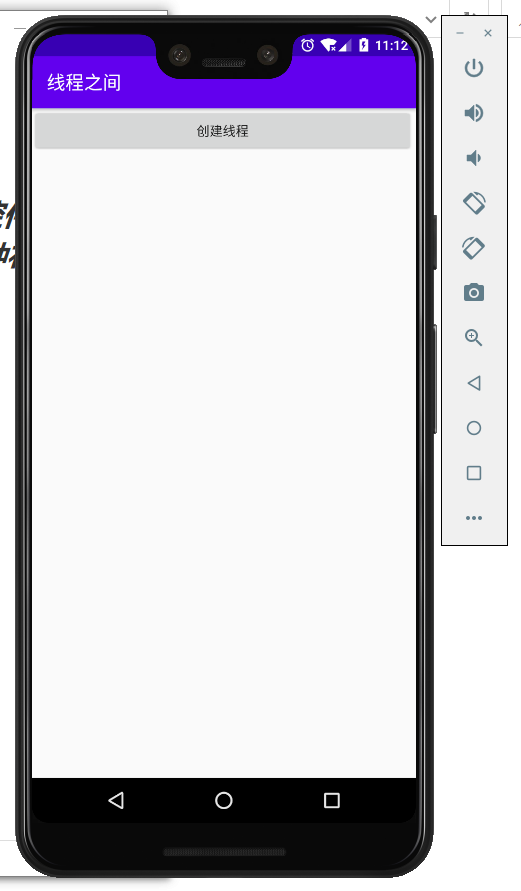
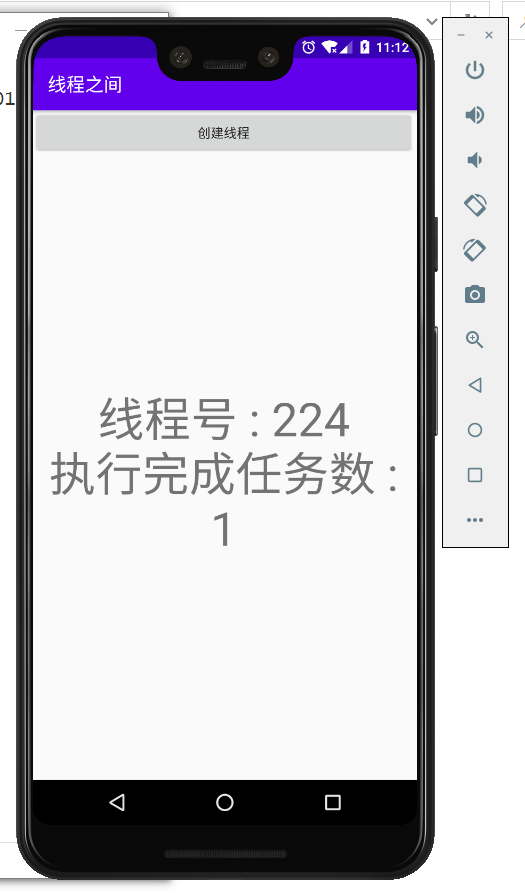
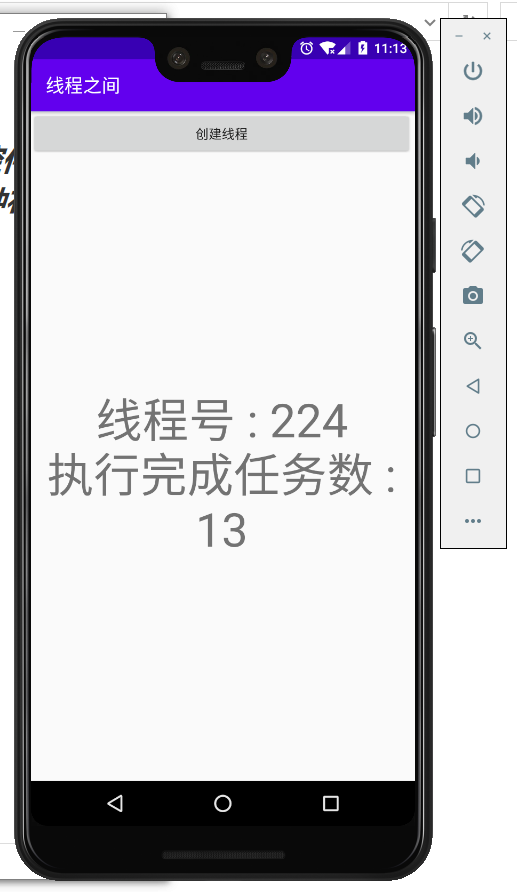
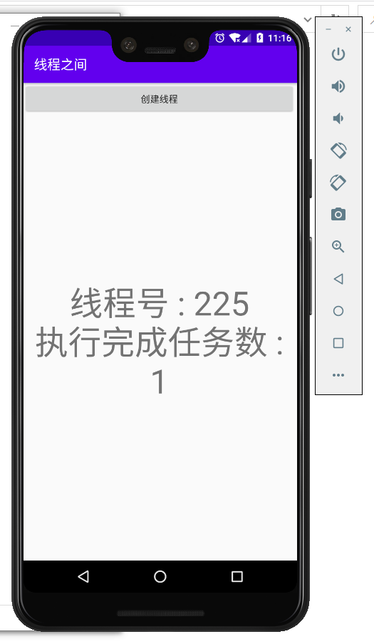
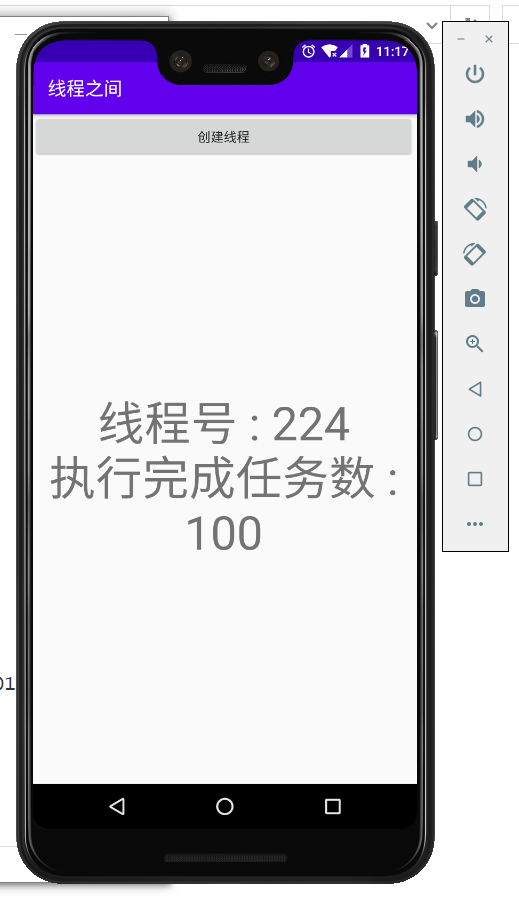
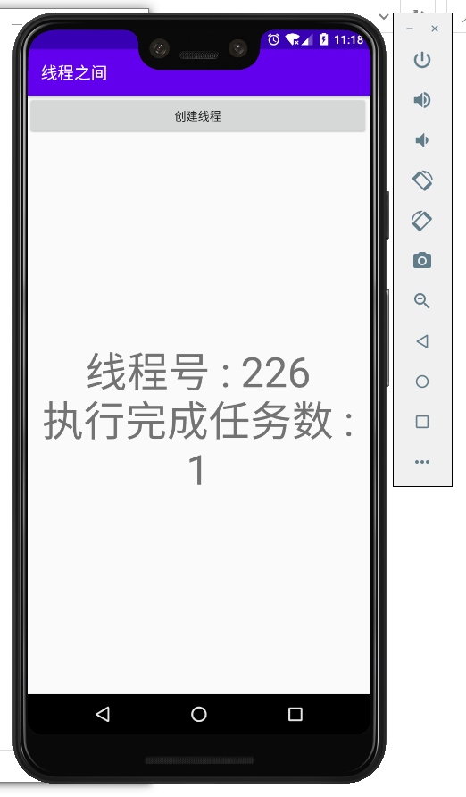
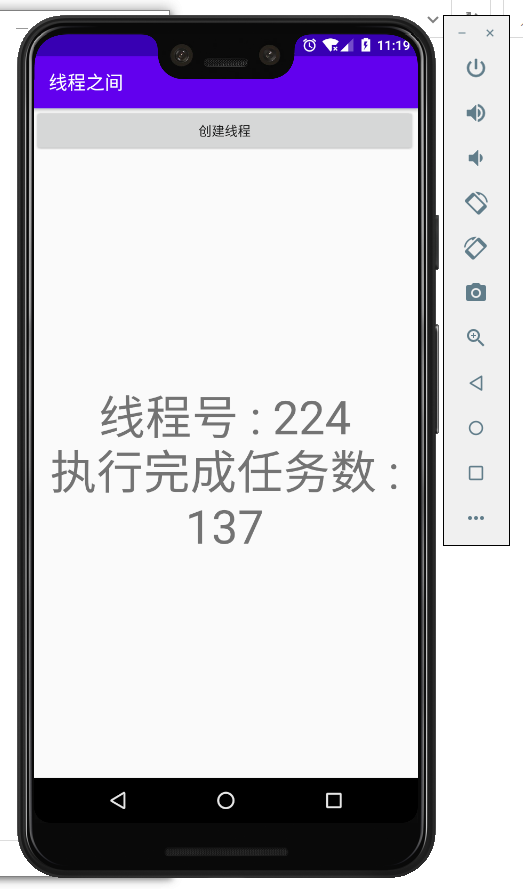

### 实验目的：掌握Android中的多线程机制

### 实验要求：创建子线程的程序框架，消息处理机制和多线程之间的数据交换

### 实验内容：

1、运行程序，可以看到一个button，点击一次将创建一个线程，界面中央会显示当前线程号以及执行完成的任务数

2、每过3秒，界面中央的显示内容将更新一次，执行完成任务数逐次增加

3、再次点击“创建线程”按钮，将创建第二个线程

4、创建的每个线程将交替显示各自的内容

5、创建三个线程也一样，以此类推

### 实验总结：

#### 心得收获：通过本次实验，使我掌握了创建子线程的方式，以及了解了多线程的运作机制，并掌握了线程之间数据交换的方法。

#### 评价：