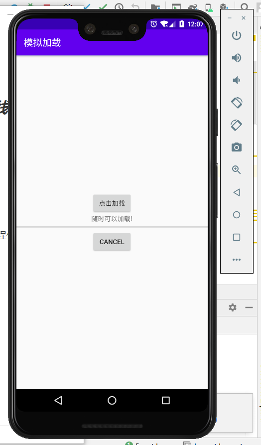
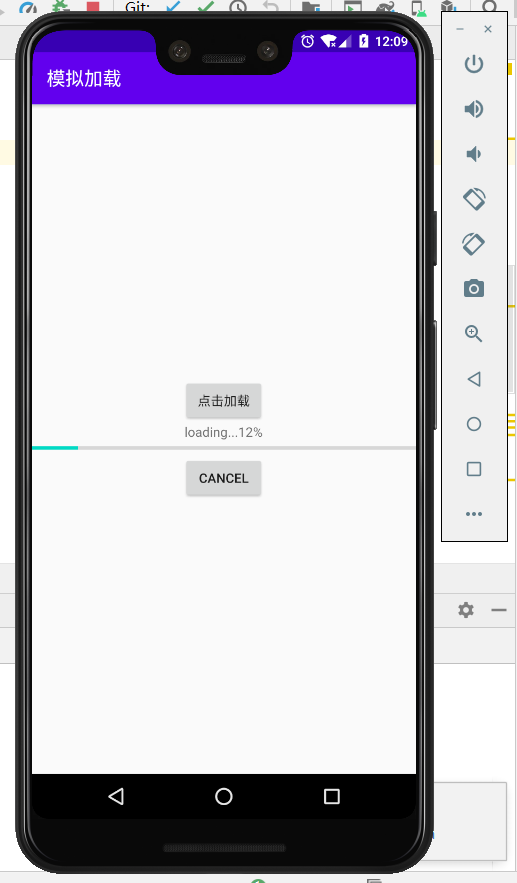
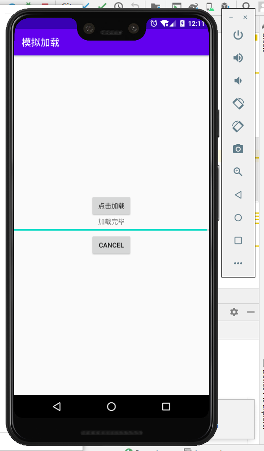
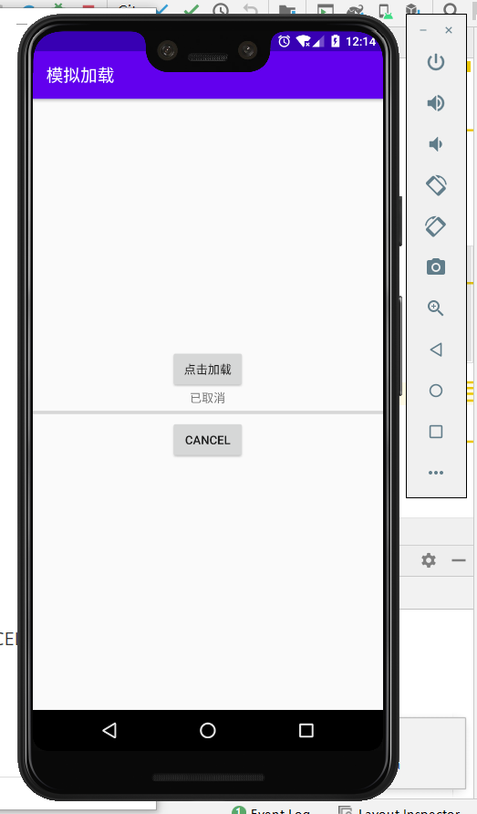

### ***\*实验目的：掌握异步任务的隐含子线程程序框架\****

### ***\*实验要求：使用AsyncTask程序框架实现多线程，以及多线程的消息处理机制和多线程之间的数据交换\****

### ***\*实验内容：\****

1、onPreExecute()方法，实现线程任务执行操作前的初始化操作

2、doInBackground(Params...)方法，接收输入参数、执行任务中的耗时操作、返回 线程任务执行的结果

3、onProgressUpdate(Progress...)方法，在主线程显示线程任务执行的进度，点击”点击加载“按钮，进度条将开始运作

4、onPostExecute(Result)方法，接收线程任务执行结果、将执行结果显示到UI组件，当进度条跑完，显示”加载完毕“

5、onCancelled()方法，将异步任务设置为取消状态，当进度条未加载完时，点击”CANCEL“按钮将

显示”已取消“

